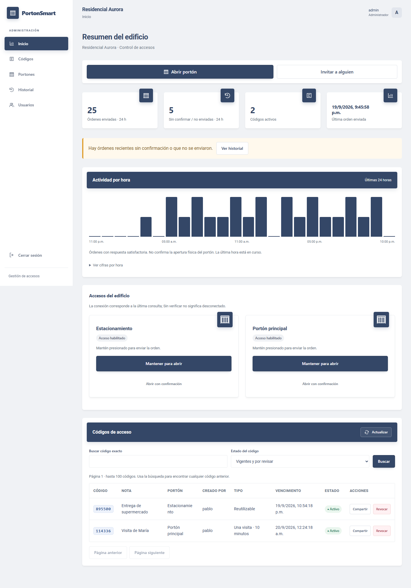
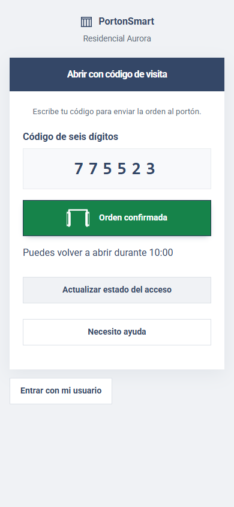

# PortonSmart — plataforma de control de accesos

Esta entrega contiene el código completo y las correcciones acumuladas, incluida la interfaz PortonSmart. Es para instalar en **una base D1 nueva y vacía**. No necesitas ejecutar archivos de limpieza ni las migraciones de las entregas anteriores.

Empieza por **[INSTALACION.md](INSTALACION.md)**. Los comandos están escritos para la terminal de Windows que ya utilizas.

La plataforma se llamaba Ábrete Sésamo. Los enlaces y nombres técnicos existentes se conservan. Consulta [la interfaz PortonSmart](docs/INTERFAZ-PORTONSMART.md) para conocer las funciones y adaptaciones del nuevo diseño.

## Qué incluye

- Varios edificios, cada uno con sus propios portones, usuarios y códigos.
- Inicio de sesión por usuario o correo y contraseña; acceso de visitantes separado.
- Permisos por portón y apertura del portón asociado al código.
- Panel de plataforma para edificios, portones, cuentas, permisos y códigos pendientes.
- Códigos reutilizables, de un uso y con vencimiento, con referencias al portón.
- Historial y métricas sobre órdenes enviadas, no sobre movimiento físico confirmado.
- Contraseñas con hash, sesiones revocables, controles de intentos y salida HTML segura.
- Gestión de respuestas HTTP, redirecciones HTTPS y fallos de comunicación del proveedor.
- Barra lateral, tarjetas, modales y asistente de creación de códigos; adaptación móvil.
- Generador de demo con datos ficticios y aperturas que no activan dispositivos reales.

## Estructura

```text
src/                         Servidor, rutas y páginas autenticadas
frontend/templates/          Plantillas del panel y Mi Acceso
frontend/src/                Alpine CSP, estilos y conexión al servidor
frontend/legacy/             Usuarios, visitantes y superadministración
frontend/reference/          Propuestas originales (no se publican)
frontend/dist/               Archivos estáticos generados (no incluidos en Git)
database/schema.sql          Único esquema para instalar de cero
database/verificar.sql       Comprobación sin UNION ALL
tools/crear-superadmin.mjs    Genera un alta con contraseña aleatoria y hash
tools/crear-demo.mjs          Genera el tenant ficticio para vista previa
tools/build-client.mjs       Genera la fuente de navegador sin errores del empaquetador
tools/generar-clave.mjs       Genera una clave aleatoria para firmar sesiones
tools/verificar-bd.mjs        Consulta el estado de la BD, sin modificarla
tests/                       Pruebas locales; fixtures históricos solo para pruebas
wrangler.toml                Configuración: completar únicamente el ID de la nueva BD
INSTALACION.md               Guía detallada
```

`.private/` se crea al generar accesos. No está incluida en el paquete y está excluida de Git. Contiene archivos privados que no debes publicar.

## Validación realizada

- 76 pruebas automáticas, incluida una instalación vacía completa.
- Interfaz probada en navegador con el Worker completo empaquetado y minificado: login, selección, creación y uso de códigos, historial, edición y separación de edificios, menú móvil y contenido hostil.
- Aperturas probadas con respuestas simuladas; no se enviaron órdenes a dispositivos reales.
- Para actualizar una instalación existente, sigue ACTUALIZACION-AUDITORIA.md. La integración física debe verificarse en sitio.

## Vistas de referencia

Datos ficticios de demostración:





## Repositorio y respaldo

Incluye el firmware en `firmware/`, la conexión MQTT en [docs/RELES-MQTT.md](docs/RELES-MQTT.md) y los enlaces automáticos en [docs/ENLACES-EDIFICIOS.md](docs/ENLACES-EDIFICIOS.md).

El repositorio conserva el código y el esquema, no los datos de producción. Consulta [docs/RESPALDO.md](docs/RESPALDO.md). No ejecutes la instalación inicial sobre la base existente.
